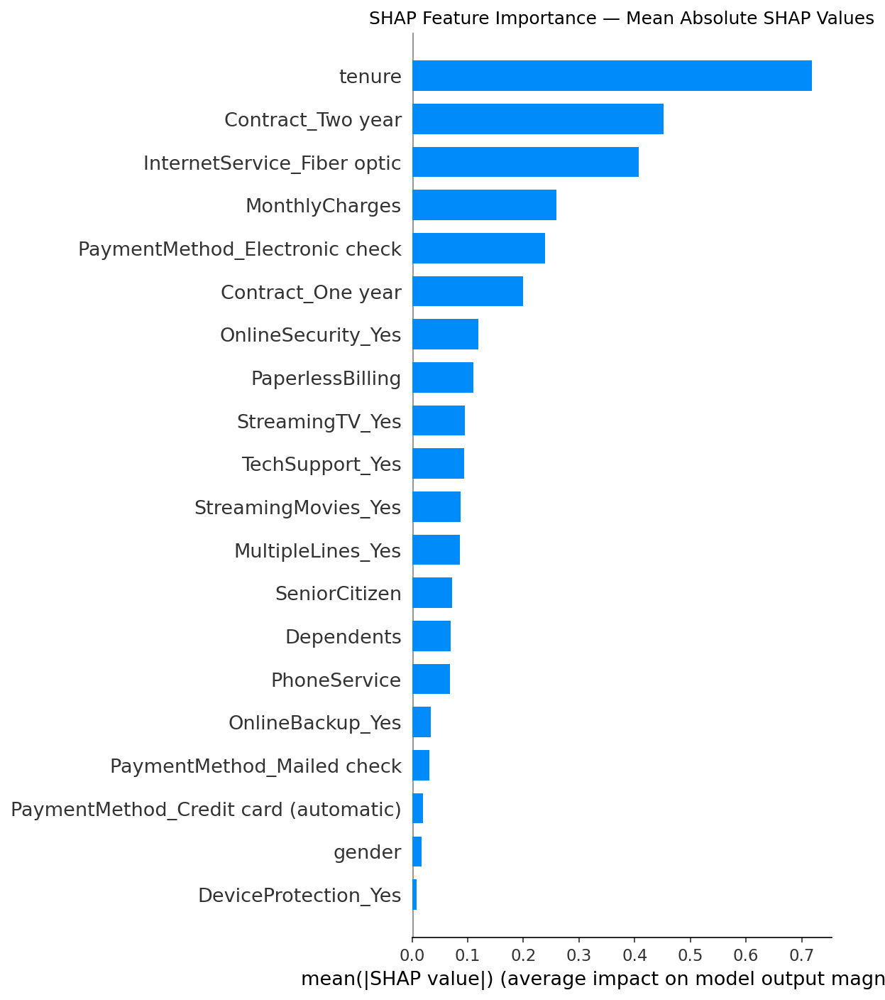
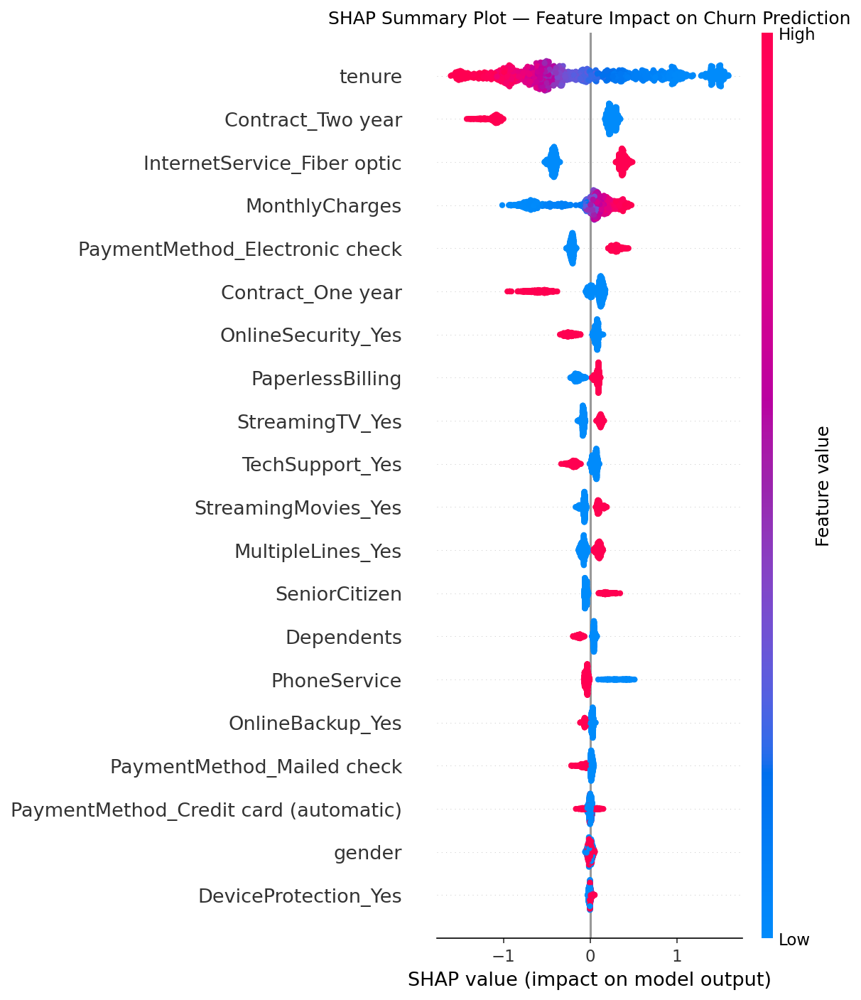
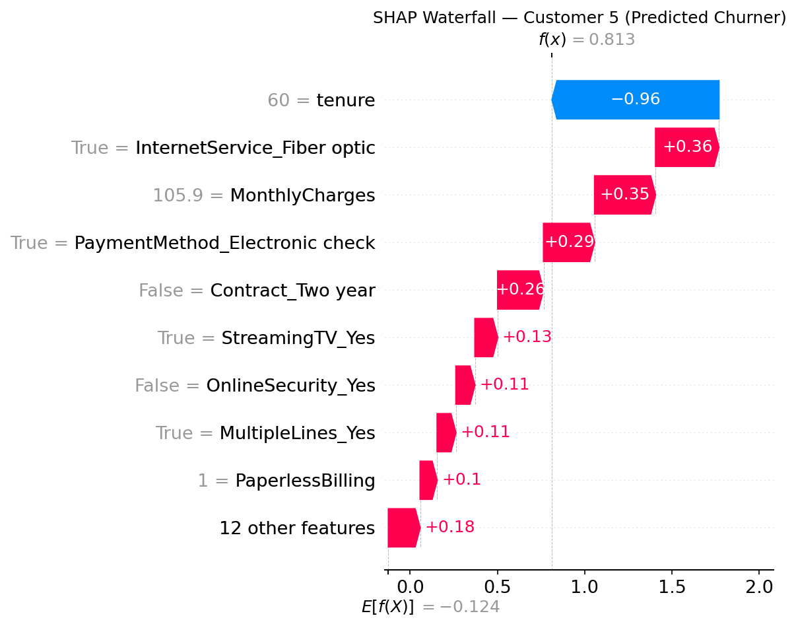
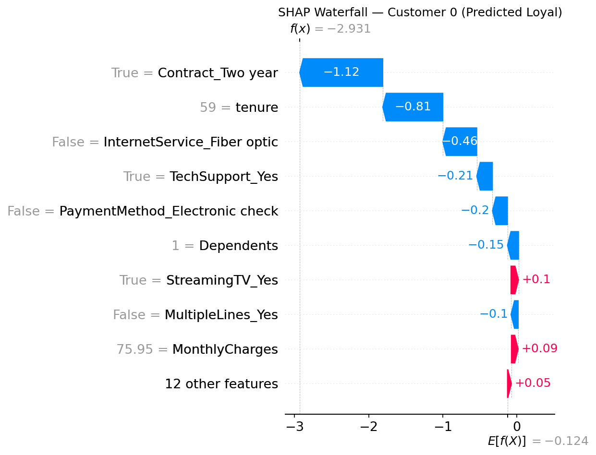

# Customer Churn Prediction with CatBoost + SHAP

## Overview
Predicting customer churn for a telecom company using CatBoost
with Optuna hyperparameter tuning, SHAP explainability, and 
class-weight based imbalance handling.
Benchmarked against published Kaggle ensembles — single CatBoost 
model (AUC 0.8421) outperforms a 4-model stacked ensemble (AUC 0.8301).

## Live App
[Click here to try the app](your-streamlit-link-here)

## Dataset
Telco Customer Churn — Kaggle (7,032 rows, 20 features after cleaning)

## Model Results

| Version | AUC-ROC | F1 | Recall | Approach |
|---------|---------|-----|--------|----------|
| Baseline CatBoost | 0.8235 | 0.5945 | 0.6684 | Default params |
| Optuna v1 | 0.8026 | 0.5806 | 0.6070 | SMOTE + depth 10 (overfit) |
| Optuna v2 | 0.8145 | 0.5993 | 0.6497 | SMOTE + depth 6 |
| **Optuna v3 (Final)** | **0.8421** | **0.6195** | **0.8075** | No SMOTE + class weights |
| Published ensemble (4 models) | 0.8301 | 0.83 | — | XGB+LGBM+RF+DT stack |

**Final model catches 8 out of 10 actual churners (Recall: 0.8075)**

## Key EDA Findings

### 7 Quantified Insights from 7,032 Telecom Customers

**1. Class Imbalance**
- 73.5% No churn, 26.5% churn
- Accuracy alone misleading — used F1 and AUC-ROC as primary metrics

**2. Contract Type — Strongest Signal**
- Month-to-month: 42.7% churn
- One year: 11.3% churn
- Two year: 2.8% churn
- 15x difference between month-to-month and two-year customers

**3. Tenure and Monthly Charges**
- Churned customers: median tenure 10 months, median bill $79.65
- Retained customers: median tenure 38 months, median bill $64.45
- New + high-paying customers are the most at-risk segment

**4. Highest Risk Segment**
- Month-to-month + Fiber Optic + Electronic Check = 60.4% churn
- 2.3x higher than overall average — 6 in 10 customers leave

**5. Security Services as Retention Anchors**
- Without OnlineSecurity: 41.8% churn → With: 14.6% (2.9x difference)
- Without TechSupport: 41.6% churn → With: 15.2% (2.7x difference)
- Streaming services show almost no difference

**6. Senior Citizens**
- Senior citizens: 41.7% churn vs 23.7% non-seniors
- Senior + Fiber Optic = 47.3% churn — second highest risk segment

**7. Gender — Negative Finding**
- Female: 27.0% vs Male: 26.2% — only 0.8% difference
- Gender has zero predictive power — confirmed by SHAP importance

## SHAP Explainability

### Global Feature Importance

### Feature Impact on Churn (Direction + Magnitude)

### Individual Customer Explanation — Churner

### Individual Customer Explanation — Loyal Customer

**Example — Customer 5 (69.3% churn probability):**
- Fiber Optic service: +0.36 (pushes toward churn)
- Monthly charges $105.9: +0.35 (pushes toward churn)
- Electronic check payment: +0.29 (pushes toward churn)
- Tenure 60 months: -0.96 (pushes away from churn)
- Retention recommendation: offer 2-year contract + 15% discount
  + auto-payment switch — directly addresses all 3 churn drivers

## Postmortem — What Went Wrong and How I Fixed It

**Problem 1 — Overfitting in Optuna v1**
- CV AUC: 0.9223, Test AUC: 0.8026 — gap of 0.12
- Root cause: depth=10 on 8,260 row dataset
- Fix: constrained depth to 6, increased CV folds 3→5
- Result: gap reduced to 0.006

**Problem 2 — SMOTE hurting generalization**
- Without SMOTE CV AUC: 0.8298 vs with SMOTE: 0.8145
- Root cause: synthetic samples misled model on real distribution
- Fix: replaced SMOTE with CatBoost auto_class_weights='Balanced'
- Result: AUC improved to 0.8421

**Problem 3 — Noise features**
- 8 "No internet service" dummy columns had near-zero SHAP importance
- Fix: removed all 8 features (29 → 21 features)
- Result: cleaner signal, better generalization

## Tech Stack
Python · Pandas · NumPy · Scikit-learn · CatBoost · 
Optuna · SHAP · WandB · Streamlit · Matplotlib · Seaborn

## Project Structure
churn-prediction-catboost/
├── notebooks/
│   ├── 01_eda.ipynb
│   ├── 02_preprocessing.ipynb
│   └── 03_models.ipynb
├── app/
│   └── app.py
└── README.md

## How to Run
1. Download dataset from Kaggle: Telco Customer Churn
2. Run notebooks in order: 01 → 02 → 03
3. Run Streamlit app: streamlit run app/app.py
